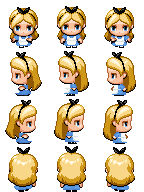
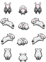
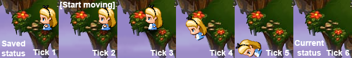
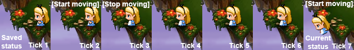
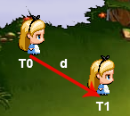
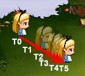

class: center, middle

# Event-based online game in Scala


<div style="text-align: right">Álvaro García Delgado</div>

---

# Agenda

### 1. Introduction: client and server definition
### 2. Client implementation
### 3. Server implementation
### 4. Improvements

---

# Libraries used

- Shared

  - FS2
  
  - Cats Effect
  
  - Circe
  
- Client

  - Scala JS
  
- Server

  - Http4s

---

# Main types

### fs2\\.Stream[F, A]

<div style="display: flex">

<div class="mermaid">
graph LR
    subgraph "" 
        A("F[A]")
    end
    A --> B((A))
</div>

- Emits elements of type A

</div>
--

### fs2\\.Pipe[F, A, B]

<div style="display: flex">

<div class="mermaid">
graph LR
    subgraph "" 
        A("???")
    end
    A --> B((B))
    C((A)) --> A
    
</div>

- Consumes elements of type A
- Emits elements of type B
- Alias for `Stream[F, A] => Stream[F, B]`

</div>

---

# Basic types (I)

#### Tick
Smallest unit of time measurement for the game 
```scala
val tick: Long
```

#### Command
What the player wants to do (it might not happen)

```scala
case class Command(
  requestId: String,   // Unique identifier
  name: String,        // Who?
  body: Message        // What?
)
```

---

# Basic types (II)

#### Event
What has happened (it cannot change)

```scala
case class Event(
  tick: Long,          // When?
  playerId: String,    // Who?
  body: Message,       // What?
  requestId: String,   // Unique identifier
  timestamp: Long      // Local time
)
```

---

# Server definition

A game server will:
- Receive commands from the client
- Validate and transform commands to events
- Update game status with events
- Send events to clients
--


This could be defined just as:
```scala
  val serverPipe: Pipe[F, Command, Event]
```

---

# Client definition (I)

A game client will:
- Generate and send commands to the server
- Receive events from the server
- Update local game status with events
- Draw game status every certain time
--


Can be defined as:
```scala
  val actionStream: Stream[F, Command]

  val updateStatusPipe: Pipe[F, Event, GameStatus]

  val drawStatusPipe: Pipe[F, GameStatus, Unit]
```
    
---
# Client definition (II)
First approach:
<div style="display: flex">

<div class="mermaid" style="zoom: 80%">
graph TD
    A(action)
    -->|Command| B(server)
    -->|Event| C(updateStatus)
    -->|GameStatus| D(drawStatus)
</div>    

- Player performs an action

- A command is sent to the server

- Server validates the action

- Server sends the event to all players

- Client draws the new status

</div>   
    
---
# Client definition (IV)
Second approach:
<div style="display: flex">

<div class="mermaid">
graph TD
    A(action)
    -->|Command| B(server)
    -->|Event| C(updateStatus)
    -->|GameStatus| D(drawStatus)
    
    E(tick) --> |"Tick every 10ms"| C
</div>    

- Server sends the event to all clients

- An update by event doesn't emit a GameStatus

- A tick is emitted every 10 milliseconds

- Client updates status for every tick

- Client draws the new status

</div>    

---
class: center, middle

# Game Client Implementation

---

# Game Graphics



http://i.imgur.com/3nUVyUf.png



https://rmvxblog.files.wordpress.com/2010/06/white-bunny.png

---

# Game Status Model

#### Character
```scala
case class Character(
    name: String,
    x: Float,
    y: Float,
    z: Float,
    sx: Float,
    sy: Float,
    sz: Float,
    frame: Int,
    dir: Direction,
    moving: Set[Direction]
)
```
#### Game Status
```scala
case class GameStatus(tick: Long, characters: List[Character])
```

---

# Game Status Update

```scala
object GameLogic {

  def updateStatusWithEvent(status: GameStatus, event: Event): GameStatus = {}

  def updateStatusWithTick(status: GameStatus): GameStatus = {}

}
```

Update with Event:
- **Join**: Adds a new player
- **StartMove**(Direction): player starts to move
- **StopMove**(Direction): player stops
- **Quit**: Removes a player

Update with Tick:
- Updates player speed
- Updates player position
- Game logic checks


---

# Interaction with JS

### One time callbacks to F[A]
```scala
def loadImg[F[_]](name: String)(implicit F: Async[F]): F[dom.html.Image] = 
  F.async { cb =>
    val img = dom.document.createElement("img").asInstanceOf[dom.html.Image]
    img.src = s"/images/$name.png"
    img.onload = (_: dom.Event) => cb(Right(img))
  }
```

### Multiple time callbacks to Stream[F, A]
```scala
def keyStream[F[_]](implicit FAF: FireAndForget[F]): Stream[F, KeyAction] = 
  Queue.unbounded[F, KeyAction].map { queue =>
    dom.window.addEventListener("keydown", { (keyEvent: KeyboardEvent) => 
      FAF.fireAndForget(queue.enqueue1(KeyDown(keyEvent.key)))
    }
    queue.dequeue
  }
```

---
class: gifs

# Player Action Stream (I)

Listen to key events and transform them into Messages (what will be sent to the server).

Movement starts when the key is pressed and stops when it's released.

```scala
val playerActionStream: IO[Stream[IO, Message]] = Keys.keyStream[IO].map {
  _.collect[Message] {
    case KeyDown("d" | "ArrowRight") => StartMove(Direction.Right)
    case KeyDown("a" | "ArrowLeft") => StartMove(Direction.Left)
    case KeyDown("s" | "ArrowDown") => StartMove(Direction.Down)
    case KeyDown("w" | "ArrowUp") => StartMove(Direction.Up)
    case KeyUp("d" | "ArrowRight") => StopMove(Direction.Right)
    case KeyUp("a" | "ArrowLeft") => StopMove(Direction.Left)
    case KeyUp("s" | "ArrowDown") => StopMove(Direction.Down)
    case KeyUp("w" | "ArrowUp") => StopMove(Direction.Up)
  }
}
```


---

# Player Action Stream (II)

A `Join` message is emitted at the start of the stream.


```scala
val playerActionStreamIO: IO[Stream[IO, Message]] = ???
```
```scala
val joinStream: Stream[IO, Message] = Stream.emit(Join)
```
```scala
for {
  playerActionStream <- playerActionStreamIO
  actionStream = joinStream.merge(playerActionStream)
    .map(Command(UUID.randomUUID().toString, name, _))
} yield actionStream
```

`actionStream` can contain any of `Join`, `StartMove`, `StopMove` or `Ping`.

---

# Tick Stream

Tries to check every `duration` and emits the amount of elements that should have been emitted
after that time.

```scala
def evalEvery[F[_], A](duration: FiniteDuration)(fa: F[A])(
  implicit F: Sync[F], timer: Timer[F]
): Stream[F, A] = {
  val clock = Clock.extractFromTimer(timer)
  val nowStream = Stream.eval(
    clock
      .realTime(java.util.concurrent.TimeUnit.MILLISECONDS)
      .map(_/duration.toMillis)
  )

  for {
    timeRef     <- nowStream.evalMap(Ref.of[F, Long])
    _           <- Stream.fixedRate(duration)
    now         <- nowStream
    before      <- Stream.eval(timeRef.getAndSet(now))
    unitsToEmit = (now - before).toInt
    _           <- Stream.emits(List.fill(unitsToEmit)(()))
    element     <- Stream.eval(fa)
  } yield element
}
```

---
class: gifs

# Wiring everything up

```scala
val mockServerPipe: Pipe[IO, Command, Event] = ???
val actionStream: Stream[IO, Command] = ???
val tickStream: Stream[IO, Tick] = ???
val updateStatusPipe: Pipe[IO, Either[Tick, Event], GameStatus] = ???
val drawStatusPipe: Pipe[IO, GameStatus, Unit] = ???

val eventStream: Stream[IO, Event] = actionStream.through(mockServerPipe)

val eventOrTickStream: Stream[IO, Either[Tick, Event]] = 
  Utils.asEither(tickStream, eventStream)

val game: IO[Unit] = eventOrTickStream
  .through(updateStatusPipe)
  .through(drawStatusPipe)
  .compile.drain 

game.unsafeRunAsyncAndForget()
```


---
class: center, example
# Example
<div id="game23" style="zoom: 80%"></div>
<div id="output" hidden="true"></div>


---

class: center, middle

# Game Server Implementation

---

# WebSocket Implementation  (I)

Http4s provides this builder to handle WebSocket connections:

```scala
val webSocketResponse: F[Response[F]] = WebSocketBuilder[F].build(
  send: Stream[F, WebSocketFrame], 
  receive: Pipe[F, WebSocketFrame, Unit], 
  onClose: F[Unit]
)
```

And can be used as a response in a Http Server:

```scala
class CustomServer[F[_]](...) {
  def routes: HttpRoutes[F] = HttpRoutes.of[F] {
    case GET -> Root / "ws" => webSocketResponse
  }

  def stream: Stream[F, ExitCode] =
    BlazeServerBuilder[F](global)
      .bindHttp(8080, "0.0.0.0")
      .withHttpApp(routes.orNotFound)
      .serve
}
```

---

# WebSocket Implementation  (II)

<div class="mermaid">
    graph LR
    A("Client 1") -->|M1| B["Update Status"]
    C("Client 2") -->|M2| B
    B -->|"[M1', M2']"| D("Client 1")
    B -->|"[M1', M2']"| E("Client 2") 
</div>

Expected behaviour is:

- **Client 1** sends command **M1** to server
- **Client 2** sends command **M2** to server
- **Server** validates command **M1** and updates status
- **Server** broadcasts event **M1'**
- **Server** validates command **M2** and updates status
- **Server** broadcasts event **M2'**

---

# WebSocket Implementation  (III)

This can be done using a Queue to store client messages and a Topic to broadcast events:

<div class="mermaid">
    graph LR
    A("Client 1") -->|"Enqueue M1"| B["Queue"]
    B -->|"Dequeue M1"| D["Update Status"]
    D -->|"Publish M1'"| E["Topic"]
    E -->|"Receives M1'"| F("Client 1")
    E -->|"Receives M1'"| G("Client 2")
</div>

FS2 provides implementations for Queue and Topic:
```scala
val queue: Queue[F, Command] = ???

val queuePipe: Pipe[F, Command, Unit] = queue.enqueue

val queueStream: Stream[F, Command] = queue.dequeue
```

```scala
val topic: Topic[F, Event] = ???

val topicPipe: Pipe[F, Event, Unit] = topic.publish

val topicStream: Stream[F, Event] = topic.subscribe(maxSize)
```

---
# Wiring everything up (I)

New method in server to: validate command, update server status and generate events to send to clients.

```scala
def updateWithCommand(
  status: GameStatus, 
  command: Command
): (GameStatus, List[WithAudience[Event]]) = {
  val event: Event = command.toEvent(...)
  val newStatus: GameStatus = GameLogic.updateStatusWithEvent(status, event)

  val eventsToSend = event.body match {
    case Join =>
      List(
        event.copy(body = RetrieveStatus(nextStatus)).onlyFor(name),
        event.allExcept(name)
      )
    case Ping =>
      List(event.onlyFor(name))
    case _ =>
      List(event.forAll)
  }
   
  (newStatus, eventsToSend)
}
```

---
# Wiring everything up (II)
Create a stream that emits events when the server receives commands:

```scala
val queue: Queue[F, Command] = ???

val updateWithEvent: Stream[F, WithAudience[Event]] = queue.dequeue
  .evalMap(command => statusRef.modify(updateWithCommand(_, command)))
  .flatMap(Stream.emits)

val updateWithTick: Stream[F, Unit] =
  Utils.evalEvery[F, Unit](tickRate)(statusRef.update(updateStatusWithTick))

val eventStream: Stream[F, WithAudience[Event]] = 
  updateWithEvent.through(Utils.mergeAndIgnore(updateWithTick))
```

In this case updates with tick don't emit events, but it could do that as well.

---
# Wiring everything up (III)
Create a topic where events that are going to be sent to clients are published:
```scala
val topic: Topic[F, Option[WithAudience[Event]]] = ???
val eventStream: Stream[F, WithAudience[Event]] = ???

val gameStream: Stream[F, Unit] = eventStream.through(topic.publish)

val subscriptionFor: String => (Stream[F, Event], Pipe[F, Command, Unit], F[Unit]) = 
  name => (topic.subscribe(Int.MaxValue).tail
    .collect { case Some(event) => event }
    .through(WithAudience.filteredFor(name)),
    queue.enqueue,
    queue.enqueue1(Command(uuid, name, Quit))
  )
```

The name that the client provides is used in the server to filter messages to be sent.

On client disconnection, `Quit` command will be automatically included in the game server command queue.

---
# Wiring everything up (IV)

Now we can create a new game that returns:

- The stream that represents the game and has to be run

- A function that given an Id (name) returns all the components to be used in the WebSocket creation

```scala
object GameServerLogic {
  type SubscriptionFor[F[_]] = 
    String => (Stream[F, Event], Pipe[F, Command, Unit], F[Unit])

  def createGame[F[_]: Concurrent]: F[(Stream[F, Unit], SubscriptionFor[F])] = {
    for {
      queue <- Queue.unbounded[F, Command]
      statusRef <- Ref.of[F, GameStatus](GameStatus.empty)
      topic <- Topic[F, Option[WithAudience[Event]]](None)
    } yield {
      // Include code from previous slides here
      (gameStream, subscriptionFor)
    }
  }
}
```

---
# Wiring everything up (V)

Now when the WebSocket endpoint is created, the name is extracted from query parameters and is used to:
- create the stream that represents the topic subscription

- and create the pipe that will be used to send all the commands

```scala
case GET -> Root / "ws" :? NameQueryParamMatcher(name) =>
  val (out, in, onClose) = subscriptionFor(name)
  
  val wsOut: Stream[F, WebSocketFrame] = out
    .through(Utils.toJson)
    .map(Text(_))
      
  val wsIn: Pipe[F, WebSocketFrame, Unit] = s => in(s
    .collect { case Text(json, _) => json }
    .through(Utils.parseAs[F, Command])

  WebSocketBuilder[F].build(wsOut, wsIn, onClose = onClose)
```

---
class: gifs

# Wiring everything up (VI)

Http server stream and game stream are merged and run together:

```scala
object GameServer extends IOApp {

  override def run(args: List[String]): IO[ExitCode] =
    for {
      gameCreation <- GameServerLogic.createGame[IO]
      (gameStream, getSubscription) = gameCreation
      serverStream = new GameServer[IO](getSubscription).stream
      _ <- serverStream.merge(gameStream).compile.drain
    } yield ExitCode.Success

}
```


---
class: center, example
# Example (no latency)
<div id="game34" style="zoom: 70%"></div>
<div id="output" hidden="true"></div>

---
class: center, example
# Example (200ms and 500ms)
<div id="game35" style="zoom: 70%"></div>
<div id="output" hidden="true"></div>

---
class: images

# Problems in the client

- If events are used as they arrive game can get to an inconsistent state if latency changes

- Game feedback is slow from player point of view

- Clients are not synchronised with server: client 1 is not seeing the same moment as client 2


---
class: center, middle

# Improvements

---
class: images

# Solving status inconsistency

- Store all events for N last seconds

- Store Status snapshots

- If a new event is received and tick is in the past, rewind and reapply events



What if **Stop Moving** event for T=3 is received?
--




---

# Game response is slow

We can add a new pipe:

```scala
val estimateCommandPipe: Pipe[F, Command, Event] = ???
```

That transforms a Command to an Event and uses it to update the game status as soon as possible:
<div class="mermaid">
    graph LR
    A("actionStream") -->|Command| B("server")
    A -->|Command| C("estimate")
    B -->|Event| D("updateStatus")
    C -->|Estimated Event| D
</div>

When an Event from the server arrives and we have an estimated event with the same requestId, we can replace it and
rewind to correct any issues.

```scala
val eventStream: Stream[F, Event] = 
  actionStream.broadcastThrough(serverPipe, estimateCommandPipe)
```

---

# Game is not synchronised

We can re-adjust the current tick when we receive an event confirmation from the server
(Network Time Protocol).

If the server is B and the client is A:


Assuming that T3 - T2 = 0, and dTreq = dTres, we can estimate:
```scala
val dTRes = (T4 - T1)/2
val estimatedTick = T3 + dTRes
```

---
class: center, example
# Example (200ms and 500ms)
<div id="game42" style="zoom: 70%"></div>
<div id="output" hidden="true"></div>

---

# Correction is visually rough

```scala
def smoothMovement[F[_]](coeff: Float): Pipe[F, GameStatus, GameStatus] = ???
```
For coeff = 1, where diff = destination - origin



For coeff = 0.5:
- Position(t) = origin + diff (0.5<sup>1</sup> + 0.5<sup>2</sup> + ... + 0.5<sup>t</sup>)



---
class: center, example
# Example (200ms and 500ms)
<div id="game44" style="zoom: 70%"></div>
<div id="output" hidden="true"></div>

---

# Links

- [Github repository](https://github.com/algd/http4s-online-game)

- Related talk: [building multiplayer game using streams](https://www.youtube.com/watch?v=VZWxFDqDV28)

- [Network Time Protocol](https://en.wikipedia.org/wiki/Network_Time_Protocol)

---
class: center, middle

# The end